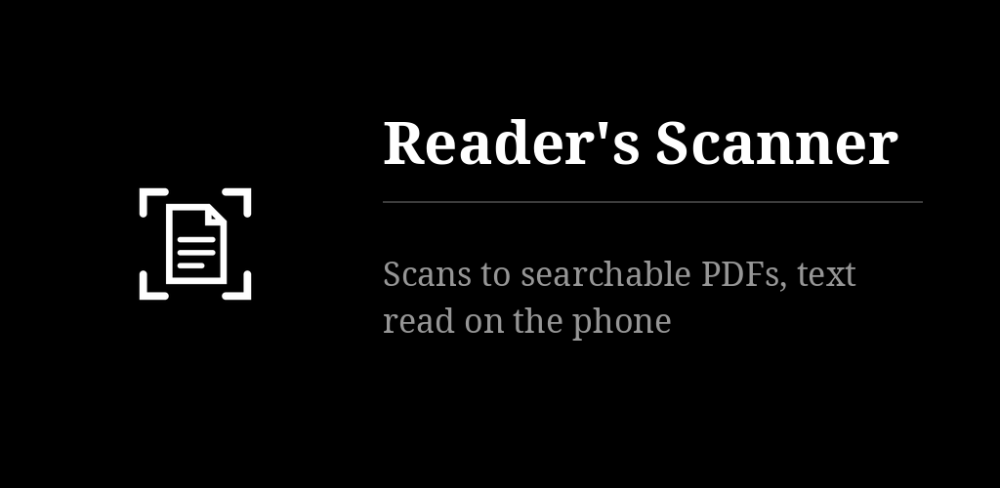

# Reader's Scanner

Scans documents with the camera, one page or many, and reads their text on the phone. Each
document becomes a searchable PDF named by you, after its date, filed in big plain
folders, and copied to your own WebDAV folder (kDrive, Nextcloud…) if you like. Black and white,
text only.

## Key points

- **Two engines, your choice at first start**: Google ML Kit (finds pages most surely, reads text
  very well; closed code, needs Google Play services, sends usage statistics to Google — never
  your documents), or the free ones: the app's own page finder and Tesseract. Both run on the
  phone. Changeable any time in the settings, step by step.
- **Capture**: the page is outlined live; touch anywhere or press a volume key. The shutter waits
  for still hands and focuses on the page; a blurred page is flagged at once, with "retake" or
  "keep". As many pages as you like, then crop (corners with a magnifier), turn, look (clean,
  grey, b & w, photo), reorder. Photos can be imported too.
- **Text**: seven languages (English, French, German, Italian, Spanish, Portuguese, Russian),
  chosen on top of the capture screen; optional "best" Tesseract models. The PDF carries the text
  invisibly over the page: search it, copy it.
- **Names**: when a scan is filed, the app asks for its name. Every file starts with the date and
  hour of capture, then the name (`2026-09-24 11h32 Facture d'électricité.pdf`); without a name,
  the date and hour alone.
- **Page format**: automatic, A series or US Letter — a page of that paper gets its exact
  proportions and the PDF its size.
- **Folders, search, sharing**: "all scans" holds everything; search looks through names and
  text; share one or several documents as PDF, pictures or text.
- **WebDAV**: a copy of each PDF in a subfolder named after its folder; renames, moves and
  deletions follow. Credentials import from a Reader's credentials file (Notes, Recorder, Tasks,
  Calendar).
- Six languages for the app (en, fr, de, es, pt, ru). Backup off, no account.

More detail: [docs/NOTES.md](docs/NOTES.md).

On the desktop (Windows, macOS, Linux), [Reader's Scanner](https://github.com/funkypitt/readers-scanner-desktop) drives a real scanner and shares the same folders through the same WebDAV folder.

## Install

- **F-Droid** (recommended, updates arrive by themselves): add the repository from [gallaz.ch/eink](https://gallaz.ch/eink/#fdroid), or the address `https://funkypitt.github.io/fdroid-repo/repo` in F-Droid.
- **Obtainium**: tap the badge on the phone, or add `https://github.com/funkypitt/readers-scanner` in Obtainium.
- **APK**: attached to the [latest release](../../releases/latest). No automatic updates.

All three deliver the same file, with the same signature.

## Build

    export JAVA_HOME=/path/to/jdk-21
    ./gradlew -Pabis=arm64-v8a,armeabi-v7a assemblePubliqueRelease
    ./gradlew testPubliqueDebugUnitTest

`prive` is a test build (its own package) with a screen comparing the readers on the same pages.
Strings for the six languages are generated from the table in `tools/strings.py`.

MIT licence. Tesseract, Leptonica and the tessdata models are Apache 2.0; Google ML Kit is
under Google's terms.
